# YACHAQ Platform - Architecture Diagrams

## Document Purpose

Comprehensive visual documentation of the YACHAQ Platform architecture using Mermaid diagrams. All diagrams are renderable in GitHub, GitLab, VS Code, and most modern markdown viewers.

**Version:** 1.0  
**Last Updated:** December 2025

---

## TABLE OF CONTENTS

1. [System Context](#1-system-context)
2. [High-Level Architecture](#2-high-level-architecture)
3. [Data Flow Diagrams](#3-data-flow-diagrams)
4. [Service Architecture](#4-service-architecture)
5. [Database Architecture](#5-database-architecture)
6. [Security Architecture](#6-security-architecture)
7. [Sequence Diagrams](#7-sequence-diagrams)
8. [Deployment Architecture](#8-deployment-architecture)

---

## 1. SYSTEM CONTEXT

### 1.1 C4 Context Diagram

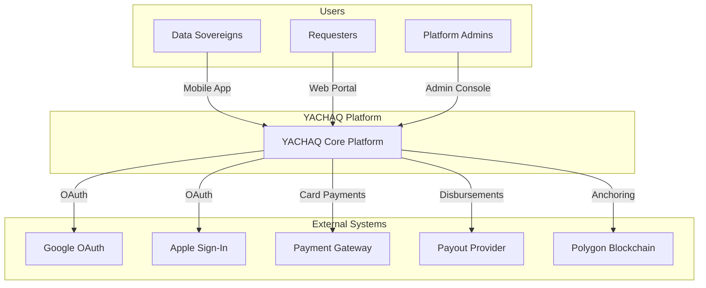

### 1.2 Actor Relationships

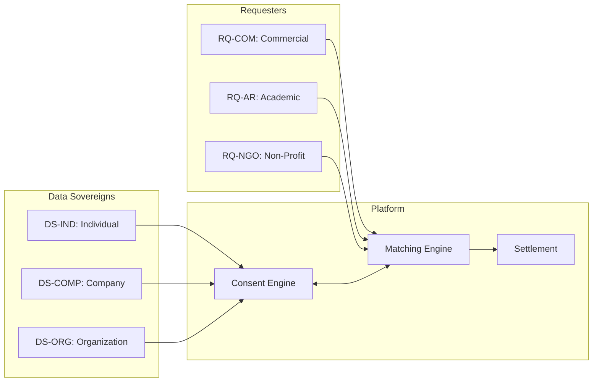

---

## 2. HIGH-LEVEL ARCHITECTURE

### 2.1 Platform Layers

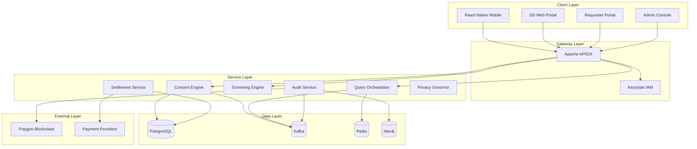

### 2.2 Trust Boundaries

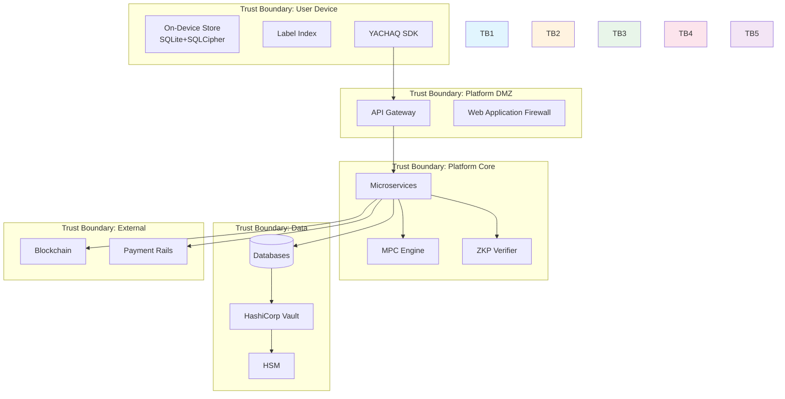

---

## 3. DATA FLOW DIAGRAMS

### 3.1 Consent Grant Flow

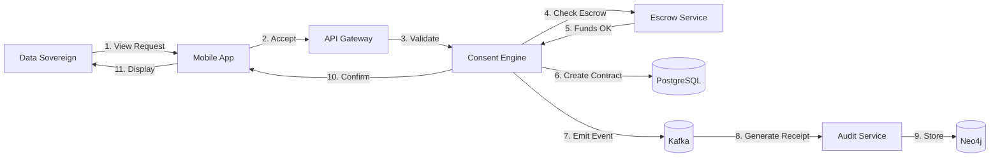

### 3.2 Query Execution Flow

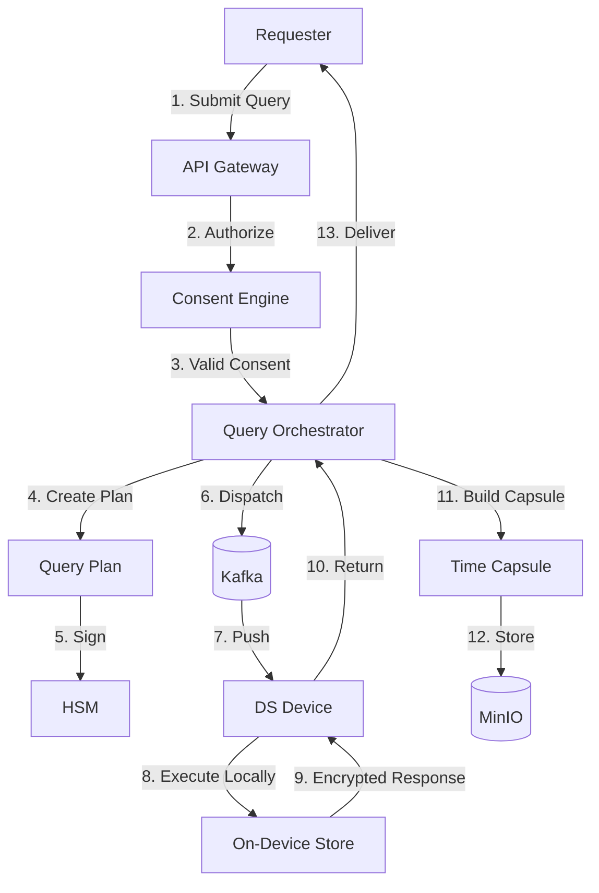

### 3.3 Settlement Flow

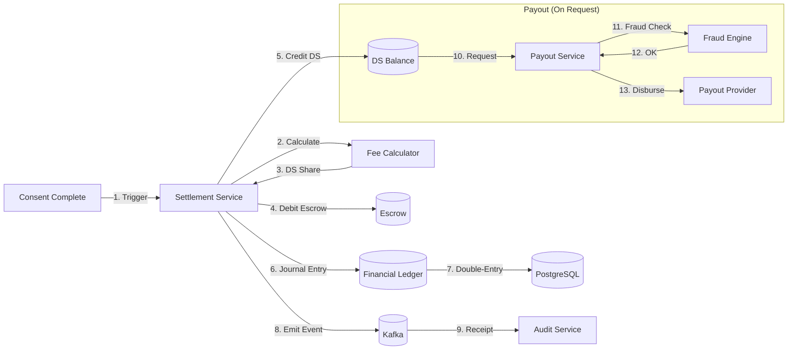

### 3.4 Data Lifecycle

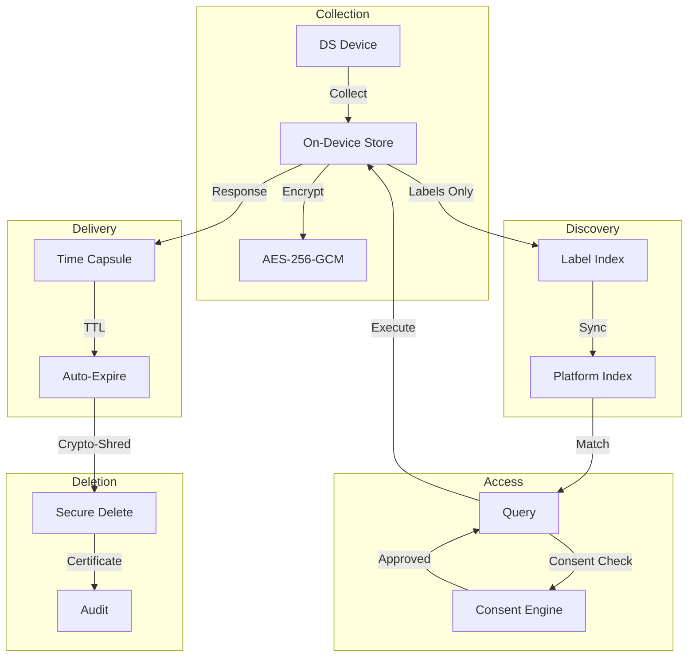

---

## 4. SERVICE ARCHITECTURE

### 4.1 Microservices Map

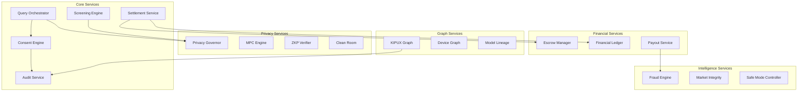

### 4.2 Service Communication

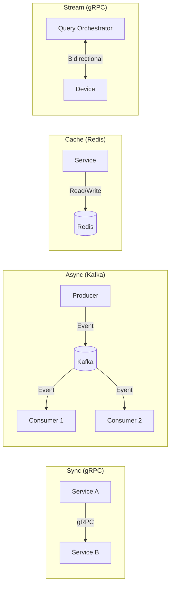

---

## 5. DATABASE ARCHITECTURE

### 5.1 Polyglot Persistence

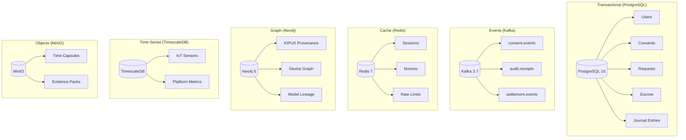

### 5.2 Data Partitioning Strategy

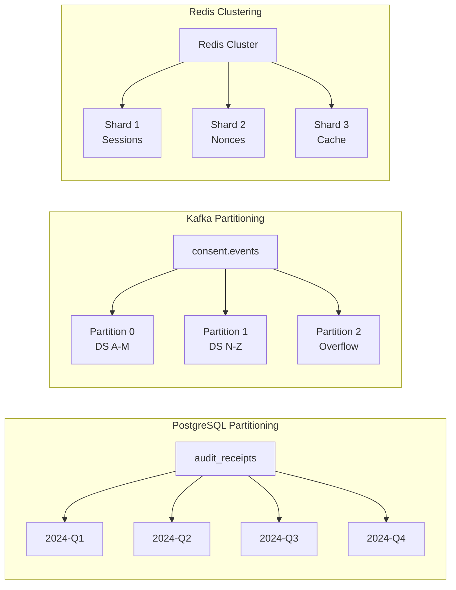

---

## 6. SECURITY ARCHITECTURE

### 6.1 Security Layers

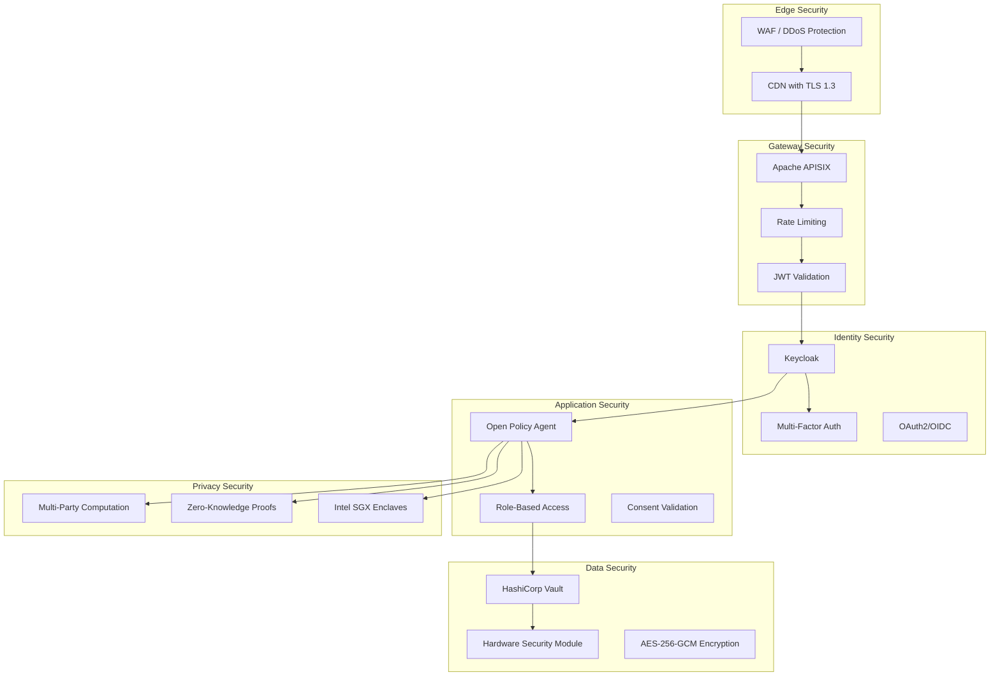

### 6.2 Key Management

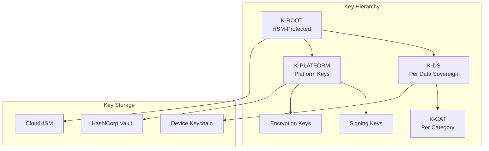

---

## 7. SEQUENCE DIAGRAMS

### 7.1 Complete Request-to-Payout Flow

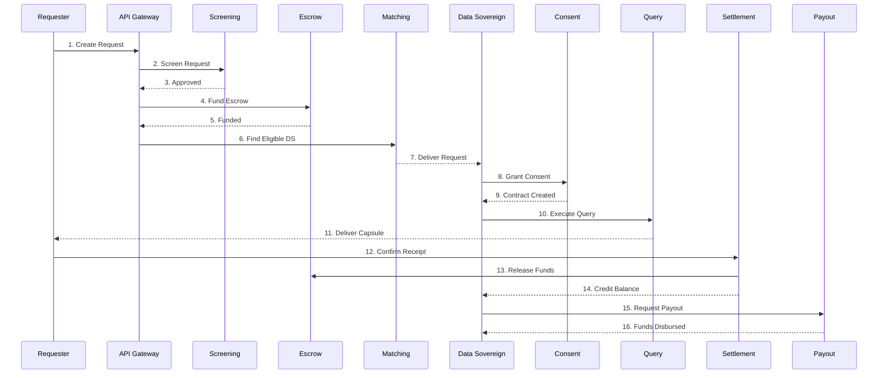

### 7.2 Consent Revocation Flow

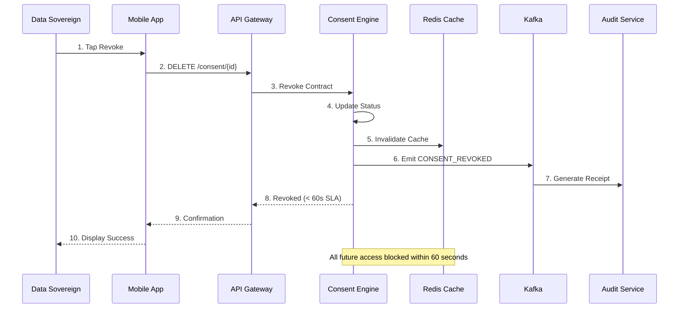

### 7.3 MPC Secure Matching

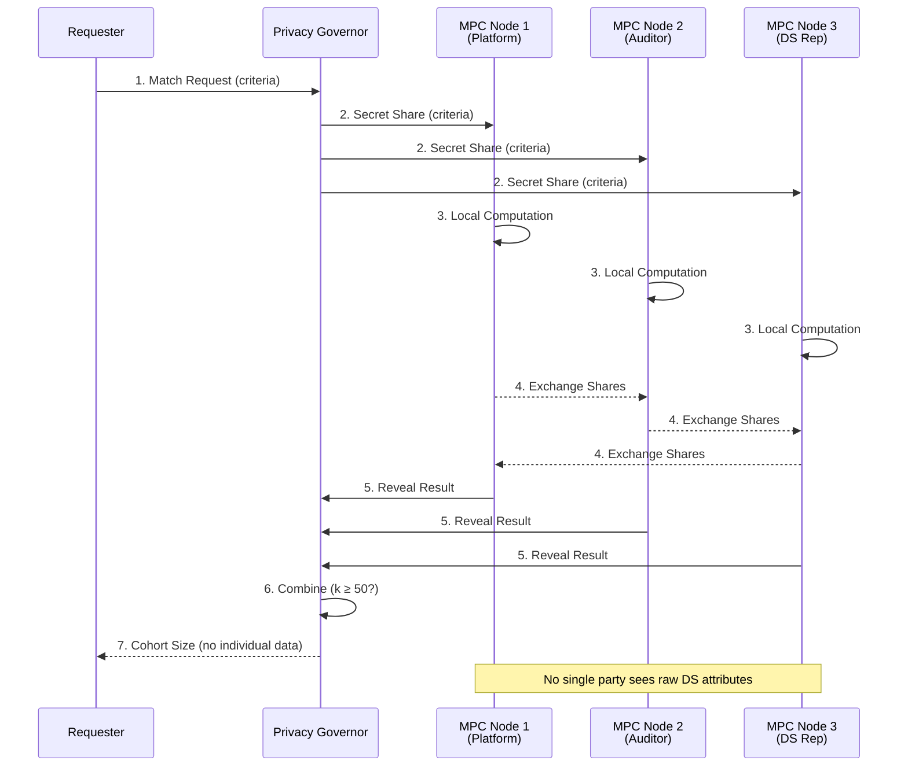

### 7.4 Clean Room Session

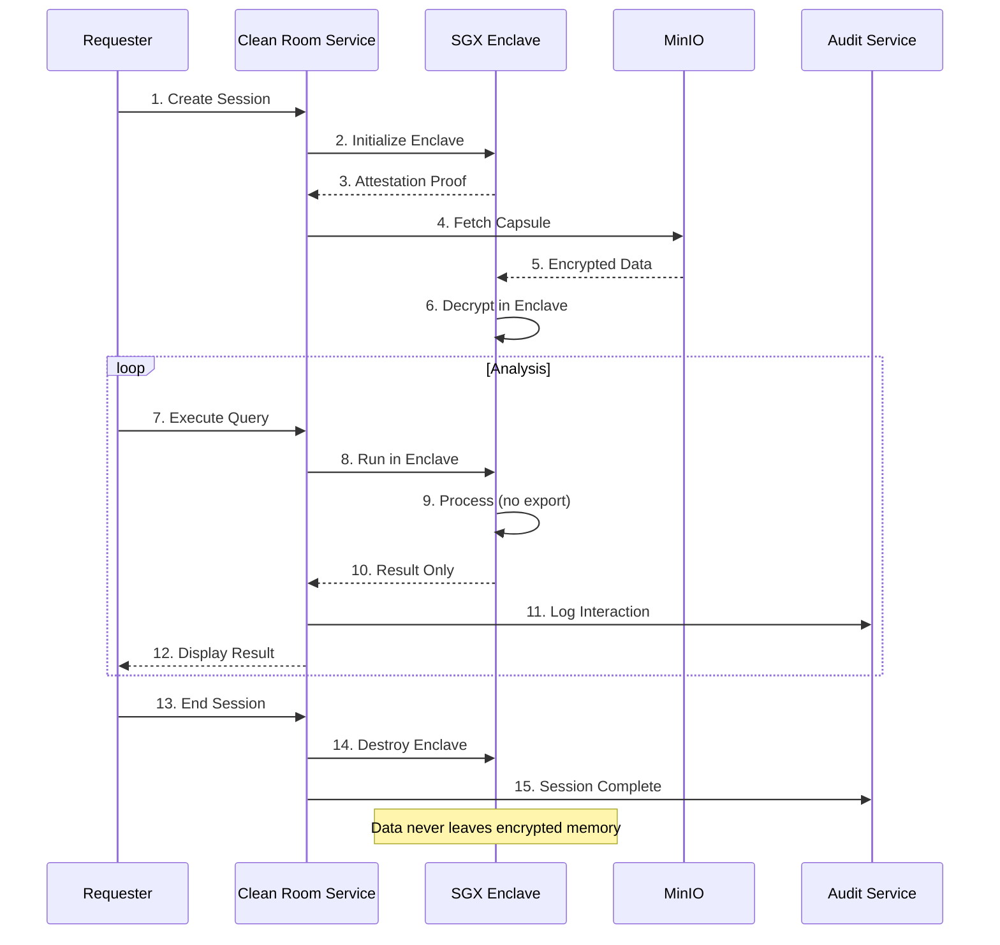

---

## 8. DEPLOYMENT ARCHITECTURE

### 8.1 Kubernetes Deployment

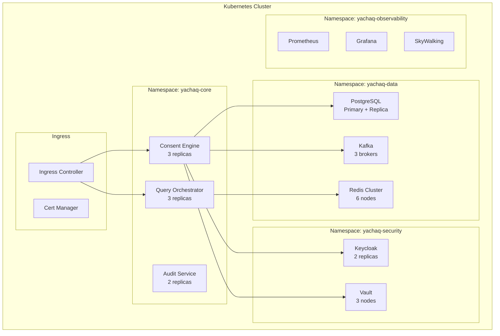

### 8.2 Multi-Region Deployment

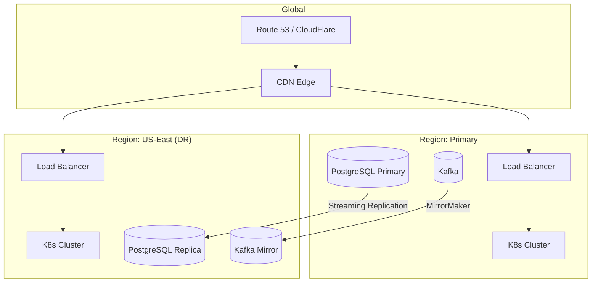

### 8.3 CI/CD Pipeline

```mermaid
flowchart LR
    subgraph "Source"
        GIT[GitHub]
    end
    
    subgraph "Build"
        GHA[GitHub Actions]
        TEST[Unit Tests]
        LINT[Linting]
        SCAN[Security Scan]
    end
    
    subgraph "Artifacts"
        REG[Container Registry]
        HELM[Helm Charts]
    end
    
    subgraph "Deploy"
        ARGO[ArgoCD]
        DEV[Dev Cluster]
        STG[Staging Cluster]
        PROD[Production Cluster]
    end
    
    GIT -->|Push| GHA
    GHA --> TEST --> LINT --> SCAN
    SCAN -->|Pass| REG
    SCAN -->|Pass| HELM
    REG --> ARGO
    HELM --> ARGO
    ARGO -->|Auto| DEV
    ARGO -->|Manual| STG
    ARGO -->|Manual + Approval| PROD
```

---

## 9. ADDITIONAL DIAGRAMS

### 9.1 KIPUX Provenance Graph Structure

```mermaid
graph LR
    subgraph "Weave (Campaign)"
        W[Weave: Campaign-123]
    end
    
    subgraph "Cords (Threads)"
        C1[Cord: DS Contribution]
        C2[Cord: Capsule Thread]
        C3[Cord: Settlement Batch]
    end
    
    subgraph "Knots (Events)"
        K1[Knot: Consent Granted]
        K2[Knot: Query Executed]
        K3[Knot: Capsule Created]
        K4[Knot: Settlement Posted]
        K5[Knot: Payout Completed]
    end
    
    W --> C1
    W --> C2
    W --> C3
    C1 --> K1
    C2 --> K2
    C2 --> K3
    C3 --> K4
    C3 --> K5
    
    K1 -->|hash| K2
    K2 -->|hash| K3
    K3 -->|hash| K4
    K4 -->|hash| K5
```

### 9.2 Device Trust Scoring

```mermaid
graph TB
    subgraph "Attestation Signals"
        SAFETY[SafetyNet/DeviceCheck]
        TPM[TPM Attestation]
        BEHAVIOR[Behavioral Analysis]
    end
    
    subgraph "Trust Calculation"
        SCORE[Trust Score Engine]
        HIGH[High Trust: 0.8-1.0]
        MED[Medium Trust: 0.5-0.8]
        LOW[Low Trust: 0.0-0.5]
    end
    
    subgraph "Actions"
        FULL[Full Access]
        LIMITED[Limited Access]
        BLOCKED[Enhanced Verification]
    end
    
    SAFETY --> SCORE
    TPM --> SCORE
    BEHAVIOR --> SCORE
    
    SCORE --> HIGH --> FULL
    SCORE --> MED --> LIMITED
    SCORE --> LOW --> BLOCKED
```

### 9.3 Privacy Risk Budget Flow

```mermaid
flowchart TB
    subgraph "Quote Phase"
        REQ[Request Created] --> ALLOC[Allocate PRB]
        ALLOC --> DRAFT[PRB: Draft]
    end
    
    subgraph "Acceptance Phase"
        DRAFT --> ACCEPT[Requester Accepts]
        ACCEPT --> LOCK[Lock PRB]
        LOCK --> LOCKED[PRB: Locked]
    end
    
    subgraph "Execution Phase"
        LOCKED --> TRANSFORM[Apply Transform]
        TRANSFORM --> CONSUME[Consume PRB]
        CONSUME --> CHECK{PRB > 0?}
        CHECK -->|Yes| TRANSFORM
        CHECK -->|No| EXHAUST[PRB: Exhausted]
    end
    
    subgraph "Blocking"
        EXHAUST --> BLOCK[Block Further Operations]
    end
```

---

**Document End**

*All diagrams use Mermaid syntax and are renderable in GitHub, GitLab, VS Code, and most modern markdown viewers.*
