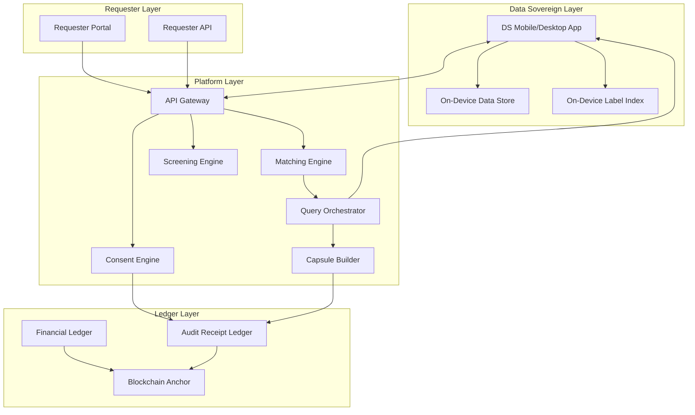
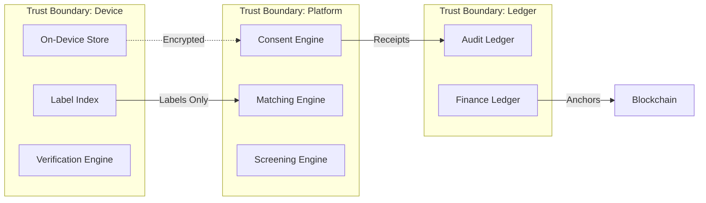

# YACHAQ Platform - Design Document

## Overview

YACHAQ is a consent-first, edge-first personal data sovereignty platform that enables individuals to control, monetize, and audit access to their personal data. The platform operates on a decentralized architecture where user data remains on devices, queries are executed live, and all transactions are recorded on an immutable audit ledger with optional blockchain anchoring.

### Core Design Principles

1. **Edge-First**: Data stays on user devices; platform queries devices live
2. **Consent-First**: Every access requires explicit, purpose-bound consent
3. **Privacy by Architecture**: Operators cannot access raw user data
4. **Transparency**: All events generate immutable audit receipts
5. **Fair Compensation**: Uniform pricing regardless of geography
6. **Decentralized**: Anyone can run nodes; no vendor lock-in

## Architecture

### High-Level Architecture Diagram



### Component Architecture



## Components and Interfaces

### 1. DS Client Suite (Mobile/Desktop)

**Purpose**: User-facing application for data management, consent control, and earnings.

**Interfaces**:
- `POST /auth/login` - OAuth2/OIDC authentication
- `GET /consent/contracts` - List active consent contracts
- `POST /consent/grant` - Grant new consent
- `DELETE /consent/{id}` - Revoke consent
- `GET /audit/receipts` - View audit timeline
- `GET /wallet/balance` - View earnings
- `POST /wallet/payout` - Request payout

### 2. On-Device Data Store (ODS)

**Purpose**: Encrypted local database storing shareable data.

**Interfaces**:
- `query(fields, transforms)` - Execute local query
- `getCategories()` - List available data categories
- `setRetention(category, policy)` - Configure retention
- `wipe()` - Secure deletion

### 3. On-Device Label Index (ODX)

**Purpose**: Privacy-safe index for discovery without exposing raw data.

**Interfaces**:
- `updateIndex(categories, tags, timestamps)` - Update index
- `getIndex()` - Get current index state
- `signIndex(deviceKey)` - Sign index for authenticity

### 4. Consent Engine

**Purpose**: Policy decision point for all data access.

**Interfaces**:
- `createContract(ds, requester, scope, purpose, duration, price)` - Create consent
- `evaluateAccess(contractId, requestedFields)` - Check if access is permitted
- `revokeContract(contractId)` - Revoke consent
- `getContracts(dsId)` - List contracts for DS

### 5. Query Orchestrator

**Purpose**: Dispatch live queries to devices and collect responses.

**Interfaces**:
- `dispatchQuery(queryPlan, eligibleDevices)` - Send queries
- `collectResponses(queryId, timeout)` - Gather responses
- `buildCapsule(responses, ttl)` - Create time capsule

### 6. Screening Engine

**Purpose**: Block abusive/illegal requests before reaching users.

**Interfaces**:
- `screenRequest(request)` - Evaluate request safety
- `getReasonCodes(screeningId)` - Get rejection reasons
- `appealDecision(screeningId, evidence)` - Submit appeal

### 7. Audit Receipt Ledger

**Purpose**: Immutable record of all platform events.

**Interfaces**:
- `appendReceipt(event, actor, timestamp, hashes)` - Add receipt
- `getReceipts(filter)` - Query receipts
- `verifyReceipt(receiptId, proof)` - Verify integrity
- `anchorBatch(receipts)` - Anchor to blockchain

### 8. Financial Ledger

**Purpose**: Double-entry accounting for all financial transactions.

**Interfaces**:
- `postEntry(debit, credit, amount, reference)` - Post journal entry
- `getBalance(accountId)` - Get account balance
- `reconcile(providerId, statement)` - Reconcile with provider

### 9. Device Attestation Service

**Purpose**: Verify device integrity and collect platform attestation proofs.

**Interfaces**:
- `collectAttestation(deviceId, platform)` - Collect SafetyNet/DeviceCheck attestation
- `verifyAttestation(deviceId, proof)` - Verify attestation proof
- `getAttestationStatus(deviceId)` - Get current attestation status
- `refreshAttestation(deviceId)` - Trigger re-attestation

### 10. Clean Room Delivery Service

**Purpose**: Controlled data access environment preventing unauthorized export.

**Interfaces**:
- `createSession(capsuleId, requesterId, ttl)` - Create clean room session
- `renderData(sessionId, query)` - Render data within session
- `logInteraction(sessionId, action)` - Log all interactions
- `terminateSession(sessionId)` - End session and cleanup

### 11. Model-Data Lineage Ledger

**Purpose**: Track which data contributed to which ML models.

**Interfaces**:
- `recordTrainingJob(jobId, datasetHashes, policyVersion)` - Record training job
- `recordContribution(dsId, jobId, batchId)` - Record DS contribution
- `getLineage(modelId)` - Get complete lineage for model
- `getDSContributions(dsId)` - Get models DS contributed to

### 12. Replay Protection Service

**Purpose**: Prevent capsule replay attacks using nonce registry.

**Interfaces**:
- `generateNonce()` - Generate unique nonce
- `registerNonce(nonce, capsuleId, ttl)` - Register nonce with TTL
- `validateNonce(nonce)` - Check if nonce is valid (unused)
- `invalidateNonce(nonce)` - Mark nonce as used

## Data Models

### Core Entities

```typescript
interface DSProfile {
  id: UUID;
  pseudonym: string;
  createdAt: DateTime;
  status: 'active' | 'suspended' | 'banned';
  preferencesHash: string;
  encryptionKeyId: string;
  accountType: 'DS-IND' | 'DS-COMP' | 'DS-ORG';
}

interface Device {
  id: UUID;
  dsId: UUID;
  publicKey: string;
  riskScore: number;
  enrolledAt: DateTime;
  lastSeen: DateTime;
  attestationStatus: 'verified' | 'pending' | 'failed';
}

interface ConsentContract {
  id: UUID;
  dsId: UUID;
  requesterId: UUID;
  requestId: UUID;
  scopeHash: string;
  purposeHash: string;
  durationStart: DateTime;
  durationEnd: DateTime;
  status: 'active' | 'revoked' | 'expired';
  compensationAmount: Decimal;
  blockchainAnchorHash?: string;
}

interface Request {
  id: UUID;
  requesterId: UUID;
  purpose: string;
  scope: RequestScope;
  eligibilityCriteria: EligibilityCriteria;
  duration: Duration;
  unitType: 'survey' | 'data_access' | 'participation';
  unitPrice: Decimal;
  maxParticipants: number;
  budget: Decimal;
  escrowId: UUID;
  status: 'draft' | 'screening' | 'active' | 'completed' | 'cancelled';
  screeningResult?: ScreeningResult;
}

interface AuditReceipt {
  id: UUID;
  eventType: EventType;
  timestamp: DateTime;
  actorId: UUID;
  actorType: 'ds' | 'requester' | 'system';
  resourceId: UUID;
  resourceType: string;
  detailsHash: string;
  merkleProof?: MerkleProof;
  previousReceiptHash: string;
}

interface TimeCapsule {
  id: UUID;
  requestId: UUID;
  consentContractId: UUID;
  fieldManifestHash: string;
  deviceAttestations: DeviceAttestation[];
  encryptedPayload: EncryptedBlob;
  ttl: DateTime;
  accessPolicy: AccessPolicy;
  status: 'created' | 'delivered' | 'expired' | 'deleted';
}

interface EscrowAccount {
  id: UUID;
  requesterId: UUID;
  requestId: UUID;
  fundedAmount: Decimal;
  lockedAmount: Decimal;
  releasedAmount: Decimal;
  refundedAmount: Decimal;
  status: 'pending' | 'funded' | 'locked' | 'settled' | 'refunded';
  blockchainTxHash?: string;
}
```

### Financial Entities

```typescript
interface JournalEntry {
  id: UUID;
  timestamp: DateTime;
  debitAccount: string;
  creditAccount: string;
  amount: Decimal;
  currency: string;
  reference: string;
  idempotencyKey: string;
}

interface PayoutInstruction {
  id: UUID;
  dsId: UUID;
  amount: Decimal;
  currency: string;
  method: 'bank_transfer' | 'mobile_money' | 'crypto';
  destinationHash: string;
  status: 'pending' | 'processing' | 'completed' | 'failed';
  receiptId?: UUID;
}
```

### Security and Attestation Entities

```typescript
interface DeviceAttestation {
  id: UUID;
  deviceId: UUID;
  platform: 'android' | 'ios' | 'desktop';
  attestationType: 'safetynet' | 'devicecheck' | 'tpm' | 'none';
  attestationProof: string;
  verifiedAt: DateTime;
  expiresAt: DateTime;
  trustLevel: 'high' | 'medium' | 'low' | 'unverified';
}

interface QueryPlan {
  id: UUID;
  requestId: UUID;
  consentContractId: UUID;
  scope: FieldScope[];
  allowedTransforms: Transform[];
  outputRestrictions: OutputRestriction[];
  compensation: Decimal;
  ttl: DateTime;
  signature: string;
  signedAt: DateTime;
}

interface NonceRegistry {
  nonce: string;
  capsuleId: UUID;
  createdAt: DateTime;
  expiresAt: DateTime;
  usedAt?: DateTime;
  status: 'active' | 'used' | 'expired';
}

interface CleanRoomSession {
  id: UUID;
  capsuleId: UUID;
  requesterId: UUID;
  startedAt: DateTime;
  expiresAt: DateTime;
  interactions: SessionInteraction[];
  exportAttempts: number;
  status: 'active' | 'terminated' | 'expired';
}

interface ModelDataLineage {
  id: UUID;
  modelId: UUID;
  trainingJobId: UUID;
  datasetHashes: string[];
  policyVersion: string;
  dsContributions: DSContribution[];
  createdAt: DateTime;
}

interface DSContribution {
  dsId: UUID;
  batchId: UUID;
  contributedAt: DateTime;
  fieldCategories: string[];
}

interface SecureDeletionCertificate {
  id: UUID;
  resourceType: string;
  resourceId: UUID;
  deletionMethod: 'crypto_shred' | 'overwrite' | 'both';
  keyDestroyed: boolean;
  storageDeleted: boolean;
  verifiedAt: DateTime;
  certificateHash: string;
}
```

## Correctness Properties

*A property is a characteristic or behavior that should hold true across all valid executions of a system-essentially, a formal statement about what the system should do. Properties serve as the bridge between human-readable specifications and machine-verifiable correctness guarantees.*

### Property 1: Consent Contract Creation Completeness
*For any* valid consent grant request with DS, requester, scope, purpose, duration, and price, creating a consent contract should result in a contract object containing all specified fields and an associated audit receipt.
**Validates: Requirements 3.1**

### Property 2: Revocation SLA Enforcement
*For any* consent revocation request, all future access attempts using that consent must be blocked within 60 seconds of the revocation timestamp.
**Validates: Requirements 3.4, 197.1**

### Property 3: Escrow Funding Prerequisite
*For any* request that passes screening, the request cannot be delivered to any DS until the escrow account is funded with at least (maxParticipants × unitPrice × maxUnits) + platformFee.
**Validates: Requirements 7.1, 7.2**

### Property 4: Uniform Compensation
*For any* request and any two Data Sovereigns participating in that request with the same unit type, the unit price must be identical regardless of their geographic location, device type, or profile attributes.
**Validates: Requirements 10.2**

### Property 5: Audit Receipt Generation
*For any* key event (consent grant, consent revoke, data access, settlement, payout), an immutable audit receipt must be generated containing: event type, timestamp, actor, resource, and details hash.
**Validates: Requirements 12.1**

### Property 6: Data Encryption at Rest
*For any* user data stored in the system (on-device or ephemeral cloud), the data must be encrypted using AES-256-GCM with a unique key per data category.
**Validates: Requirements 121.1**

### Property 7: Data Integrity Verification
*For any* critical data stored with a cryptographic hash, reading the data and recomputing the hash must produce the same value as the stored hash.
**Validates: Requirements 125.1**

### Property 8: Merkle Tree Validity
*For any* batch of audit receipts anchored to blockchain, the Merkle tree must be valid: any receipt's inclusion can be verified using the Merkle proof against the anchored root.
**Validates: Requirements 126.3**

### Property 9: Double-Entry Balance
*For any* financial transaction posted to the ledger, the sum of all debits must equal the sum of all credits.
**Validates: Requirements 186.1**

### Property 10: YC Non-Transferability
*For any* attempt to transfer YC credits between users, the transfer must be rejected unless explicitly enabled by governance policy.
**Validates: Requirements 192.1**

### Property 11: Anti-Targeting Cohort Threshold
*For any* request with eligibility criteria, the estimated cohort size must be at least 50 (k ≥ 50) before the request can be delivered to any DS.
**Validates: Requirements 196.1**

### Property 12: Edge-First Data Locality
*For any* data collection event, the raw data must be stored on the DS device, not on centralized platform servers, unless explicit consent for cloud storage exists.
**Validates: Requirements 201.1**

### Property 13: Time Capsule TTL Enforcement
*For any* time capsule with a TTL, the capsule must be automatically deleted (crypto-shred + storage deletion) within 1 hour of TTL expiration.
**Validates: Requirements 206.2**

### Property 14: Token Issuance Round-Trip
*For any* successful authentication, the issued access token when decoded must contain the correct user ID, expiration time, and scopes that were requested.
**Validates: Requirements 1.2**

### Property 15: Query Plan Signature Verification
*For any* query plan created by the platform, signing the plan and then verifying the signature must succeed; and for any tampered plan, verification must fail.
**Validates: Requirements 216.1, 216.2**

### Property 16: Capsule Replay Protection
*For any* time capsule created with a nonce, accessing the capsule with the same nonce a second time must be rejected.
**Validates: Requirements 218.1, 218.2**

### Property 17: Field-Level Access Enforcement
*For any* consent contract specifying permitted fields, executing a query must return only those permitted fields and no others.
**Validates: Requirements 219.1, 219.2**

### Property 18: Transform Restriction Enforcement
*For any* consent contract specifying allowed transforms, applying a transform not in the allowed list must be rejected.
**Validates: Requirements 220.1, 220.2**

### Property 19: Secure Deletion Verification
*For any* data deletion request using crypto-shred, the encryption keys must be destroyed and subsequent decryption attempts must fail.
**Validates: Requirements 222.1, 222.2**

### Property 20: Privacy-Safe Aggregation
*For any* aggregation query, if the group size is less than 50 (k < 50), the result must be suppressed or generalized to prevent identification.
**Validates: Requirements 229.1, 229.3**

### Property 21: Model-Data Lineage Recording
*For any* model training job using DS data, a lineage record must be created containing dataset hashes, training job ID, and policy version.
**Validates: Requirements 230.1**

### Property 22: Device Attestation Collection
*For any* device enrollment where platform attestation is available, the attestation data must be collected and stored with the device record.
**Validates: Requirements 217.1**

### Property 23: Consent Obligation Specification
*For any* consent contract granted, the contract must include data handling obligations specifying retention limits, usage restrictions, and deletion requirements.
**Validates: Requirements 223.1**

### Property 24: Multi-Device Identity Linking
*For any* DS with multiple devices, all devices must be linked to a single DS identity and queries must be routable to the appropriate device(s).
**Validates: Requirements 224.1**

## Error Handling

### Error Categories

1. **Authentication Errors (4xx)**
   - `AUTH_001`: Invalid credentials
   - `AUTH_002`: Token expired
   - `AUTH_003`: Insufficient permissions

2. **Consent Errors (4xx)**
   - `CONSENT_001`: Consent not found
   - `CONSENT_002`: Consent expired
   - `CONSENT_003`: Consent revoked
   - `CONSENT_004`: Scope violation

3. **Screening Errors (4xx)**
   - `SCREEN_001`: Policy violation
   - `SCREEN_002`: Re-identification risk
   - `SCREEN_003`: Cohort too small

4. **Financial Errors (4xx/5xx)**
   - `ESCROW_001`: Insufficient funds
   - `PAYOUT_001`: Fraud detected
   - `PAYOUT_002`: Invalid destination

5. **System Errors (5xx)**
   - `SYS_001`: Device unreachable
   - `SYS_002`: Ledger write failed
   - `SYS_003`: Blockchain anchor failed

### Error Response Format

```json
{
  "error": {
    "code": "CONSENT_003",
    "message": "Consent has been revoked",
    "details": {
      "consentId": "uuid",
      "revokedAt": "2024-01-15T10:30:00Z"
    },
    "traceId": "trace-uuid"
  }
}
```

## Testing Strategy

### Dual Testing Approach

The platform uses both unit testing and property-based testing:

- **Unit tests**: Verify specific examples, edge cases, and error conditions
- **Property tests**: Verify universal properties that should hold across all inputs

### Property-Based Testing Framework

**Framework**: fast-check (TypeScript/JavaScript)

**Configuration**: Minimum 100 iterations per property test

**Test Annotation Format**: Each property test must include:
```typescript
// **Feature: yachaq-platform, Property {number}: {property_text}**
// **Validates: Requirements X.Y**
```

### Test Categories

1. **Consent Engine Tests**
   - Property tests for consent creation, revocation, and evaluation
   - Property tests for obligation specification (Property 23)
   - Unit tests for edge cases (expired consent, invalid scope)

2. **Financial Ledger Tests**
   - Property tests for double-entry balance
   - Unit tests for reconciliation edge cases

3. **Audit Ledger Tests**
   - Property tests for Merkle tree validity
   - Unit tests for receipt verification

4. **Screening Engine Tests**
   - Property tests for cohort threshold enforcement
   - Property tests for privacy-safe aggregation (Property 20)
   - Unit tests for specific policy violations

5. **Query Orchestrator Tests**
   - Property tests for TTL enforcement
   - Property tests for query plan signature verification (Property 15)
   - Property tests for field-level access enforcement (Property 17)
   - Property tests for transform restriction enforcement (Property 18)
   - Unit tests for device timeout handling

6. **Security Tests**
   - Property tests for capsule replay protection (Property 16)
   - Property tests for device attestation collection (Property 22)
   - Unit tests for signature tampering detection

7. **Data Lifecycle Tests**
   - Property tests for secure deletion verification (Property 19)
   - Property tests for model-data lineage recording (Property 21)
   - Unit tests for crypto-shred operations

8. **Multi-Device Tests**
   - Property tests for multi-device identity linking (Property 24)
   - Unit tests for device routing and aggregation

### Integration Tests

- End-to-end flow: Request → Screen → Match → Consent → Query → Capsule → Settle → Payout
- Cross-service communication verification
- Blockchain anchoring verification

### Security Tests

- Penetration testing (quarterly)
- Authorization bypass tests
- Token replay simulations
- Data leakage tests


---

## Extended Architecture - Operational Resilience & Intelligence

### Additional Components

#### 13. Privacy Governor Service

**Purpose**: Enforce Privacy Risk Budget (PRB), k-min cohorts, and linkage defense.

**Interfaces**:
- `allocatePRB(campaignId, riskProfile)` - Allocate PRB at quote time
- `lockPRB(campaignId)` - Lock PRB at acceptance
- `consumePRB(campaignId, transformId, riskCost)` - Decrement PRB
- `checkCohort(criteria, kMin)` - Verify cohort meets k-min threshold
- `detectLinkage(requesterId, queryHistory)` - Detect linkage attack patterns

#### 14. Requester Governance Service

**Purpose**: Manage KYB tiers, DUA, reputation, and enforcement.

**Interfaces**:
- `assignTier(requesterId, verificationLevel)` - Assign requester tier
- `recordDUA(requesterId, duaVersion)` - Record DUA acceptance
- `updateReputation(requesterId, event)` - Update reputation score
- `enforceAction(requesterId, violation, evidence)` - Execute enforcement

#### 15. Verifier Service

**Purpose**: Objective checks, proofs, redundancy audits, quality scoring.

**Interfaces**:
- `verifySchema(capsuleId, schema)` - Validate against schema
- `verifyProof(capsuleId, proofType)` - Validate cryptographic proofs
- `runRedundancy(transformId, sampleRate)` - Execute redundancy sampling
- `computeQuality(unitId, method)` - Compute quality score


#### 16. Evidence Pack Generator

**Purpose**: Generate verifiable evidence bundles for compliance and audit.

**Interfaces**:
- `generatePack(campaignId)` - Generate evidence pack for campaign
- `generateBatchPack(settlementBatchId)` - Generate pack for settlement batch
- `includeMerkleProof(packId, receiptId)` - Add Merkle proof to pack
- `verifyPack(packId)` - Verify pack integrity

#### 17. Fraud & Risk Engine

**Purpose**: DS risk, requester risk, node risk, payout holds.

**Interfaces**:
- `scoreDSRisk(dsId, signals)` - Compute DS fraud risk score
- `scoreRequesterRisk(requesterId, signals)` - Compute requester risk
- `scoreNodeRisk(nodeId, signals)` - Compute node risk
- `holdPayout(dsId, reason)` - Place payout on hold
- `detectCollusion(dsIds, patterns)` - Detect collusion patterns

#### 18. Safe Mode Controller

**Purpose**: Remote config and policy toggles for safe modes.

**Interfaces**:
- `activateMode(mode, scope, reason)` - Activate safe mode
- `deactivateMode(mode, scope)` - Deactivate safe mode
- `getActiveMode()` - Get current safe mode state
- `propagateConfig(config)` - Push config to clients

#### 19. KIPUX Graph Store

**Purpose**: Store and query provenance graphs (knots, cords, weaves).

**Interfaces**:
- `appendKnot(knotType, data, cordId)` - Add receipt knot
- `createCord(cordType, metadata)` - Create thread cord
- `queryWeave(filter)` - Query provenance graph
- `computeAnomalyScore(graphId)` - Detect anomalies in graph


#### 20. DS Device Graph Service

**Purpose**: Manage DS↔Device relationships, trust scores, and compromise response.

**Interfaces**:
- `addDevice(dsId, deviceInfo)` - Add device to DS graph
- `removeDevice(dsId, deviceId)` - Remove device from graph
- `updateTrustScore(deviceId, signals)` - Update device trust
- `handleCompromise(deviceId)` - Execute compromise response
- `getDeviceGraph(dsId)` - Get all devices for DS

#### 21. IoT Division Service

**Purpose**: Separate governance for machine/sensor data.

**Interfaces**:
- `registerFleet(orgId, fleetInfo)` - Register IoT fleet
- `registerSensor(fleetId, sensorSchema)` - Register sensor
- `scoreSensorAuthenticity(sensorId)` - Compute anti-spoofing score
- `enforceIoTPolicy(requestId)` - Apply IoT-specific policies

#### 22. Market Integrity Service

**Purpose**: Auction mechanism, rate cards, manipulation detection.

**Interfaces**:
- `createAuction(requestId, budget, units)` - Create auction
- `clearAuction(auctionId)` - Clear auction at market price
- `getRateCard(category)` - Get category rate card
- `detectManipulation(requesterId, patterns)` - Detect market manipulation

#### 23. Clean-Room Hardening Service

**Purpose**: Anti-exfiltration controls and output gating.

**Interfaces**:
- `createHardenedSession(capsuleId, policy)` - Create hardened session
- `gateOutput(sessionId, output)` - Apply output gate checks
- `detectExfiltration(sessionId, signals)` - Detect exfiltration attempts
- `executeCode(sessionId, code)` - Run code in CCW (bring analysis to data)


### Extended Data Models

```typescript
// Privacy Risk Budget
interface PrivacyRiskBudget {
  id: UUID;
  campaignId: UUID;
  allocated: Decimal;
  consumed: Decimal;
  remaining: Decimal;
  rulesetVersion: string;
  lockedAt?: DateTime;
  status: 'draft' | 'locked' | 'exhausted';
}

// Requester Tier
interface RequesterTier {
  id: UUID;
  requesterId: UUID;
  tier: 'community' | 'verified' | 'enterprise';
  kybStatus: 'pending' | 'verified' | 'rejected';
  duaVersion: string;
  duaAcceptedAt: DateTime;
  reputationScore: Decimal;
  exportAllowed: boolean;
  budgetCeiling: Decimal;
}

// Policy Decision Receipt
interface PolicyDecisionReceipt {
  id: UUID;
  decisionType: 'cohort_block' | 'prb_block' | 'export_gate' | 'linkage_block';
  decision: 'allow' | 'deny' | 'escalate';
  reasonCodes: string[];
  policyVersion: string;
  modelVersion?: string;
  timestamp: DateTime;
}

// Capsule Manifest
interface CapsuleManifest {
  id: UUID;
  capsuleId: UUID;
  fieldHashes: Record<string, string>;
  transformLineage: TransformStep[];
  ttl: DateTime;
  proofRefs: string[];
  policyVersion: string;
}

// Quality Score
interface QualityScore {
  id: UUID;
  unitId: UUID;
  methodId: string;
  thresholds: Record<string, Decimal>;
  score: Decimal;
  timestamp: DateTime;
}

// Settlement Batch
interface SettlementBatch {
  id: UUID;
  entries: SettlementEntry[];
  merkleRoot: string;
  holdbackAmount: Decimal;
  reversals: ReversalEntry[];
  status: 'pending' | 'posted' | 'reconciled';
  createdAt: DateTime;
}

// Evidence Pack
interface EvidencePack {
  id: UUID;
  campaignId?: UUID;
  settlementBatchId?: UUID;
  bundlePointers: BundlePointer[];
  merkleProofs: MerkleProof[];
  auditSummary: AuditSummary;
  generatedAt: DateTime;
  verifiedAt?: DateTime;
}

// Safe Mode State
interface SafeModeState {
  id: UUID;
  globalFlags: SafeModeFlags;
  usidFlags: Record<string, SafeModeFlags>;
  activationReceipts: UUID[];
  lastUpdated: DateTime;
}

interface SafeModeFlags {
  derivedOnlyMode: boolean;
  exportOffMode: boolean;
  productPaused: boolean;
  payoutFrozen: boolean;
  nodeRestricted: boolean;
  kMinThreshold: number;
  redundancySamplingRate: Decimal;
}
```


```typescript
// KIPUX Graph Entities
interface KIPUXKnot {
  id: UUID;
  knotType: 'policy' | 'consent' | 'capsule' | 'settlement' | 'dispute';
  cordId: UUID;
  data: Record<string, any>;
  hash: string;
  timestamp: DateTime;
}

interface KIPUXCord {
  id: UUID;
  cordType: 'ds_contribution' | 'capsule_thread' | 'settlement_batch';
  metadata: Record<string, any>;
  knots: UUID[];
  createdAt: DateTime;
}

interface KIPUXWeave {
  id: UUID;
  campaignId: UUID;
  cords: UUID[];
  masterKnots: UUID[]; // Merkle roots
  anomalyScore?: Decimal;
}

// DS Device Graph
interface DSDeviceGraph {
  dsId: UUID;
  devices: DeviceNode[];
  maxSlots: number;
  tier: 'basic' | 'standard' | 'premium';
}

interface DeviceNode {
  deviceId: UUID;
  deviceType: 'mobile' | 'desktop' | 'iot';
  os: string;
  hardwareClass: string;
  attestationCapability: 'high' | 'medium' | 'low' | 'none';
  trustScore: Decimal;
  enrolledAt: DateTime;
  lastSeen: DateTime;
  status: 'active' | 'suspended' | 'revoked';
}

// IoT Division
interface IoTFleet {
  id: UUID;
  orgId: UUID;
  name: string;
  sites: IoTSite[];
  defaultPolicy: IoTPolicy;
}

interface IoTSensor {
  id: UUID;
  fleetId: UUID;
  siteId: UUID;
  assetId: UUID;
  schemaId: UUID;
  samplingRate: number;
  calibrationMetadata: Record<string, any>;
  authenticityScore: Decimal;
}

// Market Integrity
interface Auction {
  id: UUID;
  requestId: UUID;
  budget: Decimal;
  requiredUnits: number;
  bids: AuctionBid[];
  clearingPrice?: Decimal;
  status: 'open' | 'cleared' | 'cancelled';
}

interface RateCard {
  category: string;
  basePrice: Decimal;
  riskPremium: Decimal;
  qualityMultiplier: Decimal;
  lastUpdated: DateTime;
}

// License Profile
interface LicenseProfile {
  id: UUID;
  allowedPurposes: string[];
  retentionDays: number;
  sharingAllowed: boolean;
  derivativeWorksAllowed: boolean;
  watermarkRequired: boolean;
}

// Tenant Isolation
interface Tenant {
  id: UUID;
  type: 'enterprise' | 'ngo' | 'requester';
  isolationLevel: 'strict' | 'standard';
  apiKeys: APIKey[];
  rateLimits: RateLimitConfig;
}
```


### Extended Correctness Properties

#### Property 25: ODX Minimization
*For any* ODX entry generated, the entry must contain only coarse labels, timestamps, and availability bands - never raw payload content.
**Validates: Requirements 201.1, 201.2**

#### Property 26: K-Min Cohort Enforcement
*For any* discovery query with eligibility criteria, if the estimated cohort size is below k-min threshold (k < 50), the query must be blocked.
**Validates: Requirements 202.1, 202.2**

#### Property 27: Linkage Rate Limiting
*For any* sequence of queries from the same requester with high similarity, the system must enforce rate limits after threshold is exceeded.
**Validates: Requirements 203.1, 203.2**

#### Property 28: PRB Allocation and Lock
*For any* campaign quoted, a Privacy Risk Budget must be allocated; upon acceptance, the PRB must be locked and immutable.
**Validates: Requirements 204.1, 204.2**

#### Property 29: Fail-Closed Policy Evaluation
*For any* policy evaluation that fails or encounters uncertainty, the system must deny access rather than allow.
**Validates: Requirements 206.1, 206.3**

#### Property 30: Unit Semantics Payout
*For any* DS payout calculation, the amount must be based on VU (Value Unit) completion with dedupe rules - device count must not multiply payout.
**Validates: Requirements 212.1, 212.2**

#### Property 31: Earned vs Available Separation
*For any* earnings recorded, the amount must first credit to Earned (provisional) balance; transfer to Available only after clearing.
**Validates: Requirements 213.1, 213.2**


#### Property 32: Payload-Free Manifest
*For any* Time Capsule created, the manifest must include hashed fields, transform provenance, policy versions, and proof references - but never raw payload.
**Validates: Requirements 218.1, 218.2, 218.3**

#### Property 33: Objective Settlement Checks
*For any* settlement triggered, the system must verify schema validity, proof validity, TTL validity, idempotency, and policy compliance before posting.
**Validates: Requirements 219.1, 219.2, 219.3, 219.4, 219.5**

#### Property 34: TTL Requirement
*For any* Time Capsule creation attempt without TTL specification, the creation must be rejected.
**Validates: Requirements 223.1, 223.2**

#### Property 35: TTL Expiration Enforcement
*For any* Time Capsule with expired TTL, all access attempts must be denied immediately and deletion receipts must be emitted.
**Validates: Requirements 224.1, 224.2**

#### Property 36: No Payload in Logs
*For any* log entry, crash report, or trace generated, the content must not include payload data.
**Validates: Requirements 225.1, 225.2, 225.3**

#### Property 37: Capsule Replay Protection
*For any* Time Capsule access with a previously used nonce, the access must be rejected and logged.
**Validates: Requirements 226.1, 226.2**

#### Property 38: Double-Entry Settlement
*For any* settlement entry posted, the ledger must maintain double-entry accounting with balanced debits and credits; corrections must use reversals only.
**Validates: Requirements 229.1, 229.2**

#### Property 39: Evidence Pack Generation
*For any* completed campaign or settlement batch, an Evidence Pack must be generated containing PRB allocation, consent receipts, capsule manifests, and Merkle proofs.
**Validates: Requirements 237.1, 237.2, 237.3, 237.4, 237.5**


#### Property 40: Merkle Proof Validity
*For any* Evidence Pack generated, the Merkle membership proofs must be valid and verifiable against stored roots.
**Validates: Requirements 238.1, 238.2, 238.3**

#### Property 41: DS Device Graph Integrity
*For any* DS with multiple devices, the system must maintain a DS↔Device graph with device type, OS, hardware class, attestation capability, and trust score.
**Validates: Requirements 251.1, 251.2**

#### Property 42: Per-Device Consent Levels
*For any* consent configuration, the system must support DS-global, per-device, and per-category-per-device consent levels with most restrictive policy applied on conflict.
**Validates: Requirements 253.1, 253.2, 253.3, 253.4**

#### Property 43: License Profile Binding
*For any* delivery, the system must bind to a license profile specifying allowed purposes, retention, sharing, and derivative-work terms.
**Validates: Requirements 260.1, 260.2, 260.3, 260.4**

#### Property 44: Auction Clearing
*For any* auction-mode request, the system must clear at market price within policy constraints when sufficient supply exists.
**Validates: Requirements 264.1, 264.2**

#### Property 45: Fund Lock Verification
*For any* dispatch to DS, the system must verify funds are locked (authorization or wallet lock) before dispatch proceeds.
**Validates: Requirements 267.1**

#### Property 46: Clean-Room Network Blocking
*For any* clean-room session, outbound network must be blocked by default with only allowlisted connections permitted.
**Validates: Requirements 268.1, 268.2**


#### Property 47: KIPUX Weave Representation
*For any* campaign execution, the lifecycle must be represented as a KIPUX weave with knots (receipts), cords (threads), and master knots (Merkle roots).
**Validates: Requirements 281.1, 281.2, 281.3, 281.4**

#### Property 48: Graph Anomaly Detection
*For any* provenance graph analyzed, the system must detect unusually dense DS clusters, repeated near-identical requests, and suspicious routing patterns.
**Validates: Requirements 283.1, 283.2, 283.3, 283.4**

#### Property 49: PRB Risk Cost Accounting
*For any* transform executed, the system must compute risk cost based on transform type and sensitivity; exports must consume orders-of-magnitude more PRB than derived metrics.
**Validates: Requirements 284.1, 284.2, 284.3**

#### Property 50: Campaign Planning Optimization
*For any* campaign planning, the system must maximize expected fill while enforcing budget, time, capacity, privacy, and fairness constraints.
**Validates: Requirements 286.1, 286.2, 286.3, 286.4, 286.5**

#### Property 51: AI Consent Override Prevention
*For any* AI operation, the system must prevent AI from overriding consent, altering QueryPlan scope, enabling narrow targeting, or finalizing payouts without deterministic checks.
**Validates: Requirements 289.1, 289.2, 289.3, 289.4, 289.5**

#### Property 52: Tenant Isolation
*For any* multi-tenant operation, the system must isolate campaign visibility, clean-room sessions, evidence packs, and API keys between tenants.
**Validates: Requirements 294.1, 294.2, 294.3, 294.4**


### Extended Testing Strategy

#### Additional Test Categories

**9. Privacy Governor Tests**
- Property tests for ODX minimization (Property 25)
- Property tests for k-min cohort enforcement (Property 26)
- Property tests for linkage rate limiting (Property 27)
- Property tests for PRB allocation and lock (Property 28)
- Property tests for fail-closed behavior (Property 29)
- Unit tests for PRB exhaustion edge cases

**10. Fraud & Risk Engine Tests**
- Property tests for unit semantics payout (Property 30)
- Property tests for earned vs available separation (Property 31)
- Property tests for collusion detection patterns
- Unit tests for velocity limit enforcement

**11. Verifier Service Tests**
- Property tests for payload-free manifest (Property 32)
- Property tests for objective settlement checks (Property 33)
- Property tests for TTL requirement (Property 34)
- Property tests for TTL expiration enforcement (Property 35)
- Unit tests for schema validation edge cases

**12. Evidence Pack Tests**
- Property tests for evidence pack generation (Property 39)
- Property tests for Merkle proof validity (Property 40)
- Unit tests for pack verification

**13. KIPUX Graph Tests**
- Property tests for KIPUX weave representation (Property 47)
- Property tests for graph anomaly detection (Property 48)
- Unit tests for graph query performance

**14. DS Device Graph Tests**
- Property tests for device graph integrity (Property 41)
- Property tests for per-device consent levels (Property 42)
- Unit tests for compromise response

**15. Market Integrity Tests**
- Property tests for auction clearing (Property 44)
- Property tests for fund lock verification (Property 45)
- Unit tests for manipulation detection

**16. Clean-Room Hardening Tests**
- Property tests for network blocking (Property 46)
- Property tests for output gating
- Unit tests for exfiltration detection

**17. AI Governance Tests**
- Property tests for AI consent override prevention (Property 51)
- Unit tests for AI decision recording

**18. Multi-Tenancy Tests**
- Property tests for tenant isolation (Property 52)
- Penetration tests for cross-tenant data inference


### Extended Error Handling

#### Additional Error Categories

**6. Privacy Errors (4xx)**
- `PRB_001`: Privacy Risk Budget exhausted
- `PRB_002`: PRB not allocated
- `COHORT_001`: Cohort below k-min threshold
- `LINKAGE_001`: Linkage rate limit exceeded
- `EXPORT_001`: Export not permitted for tier

**7. Verification Errors (4xx)**
- `VERIFY_001`: Schema validation failed
- `VERIFY_002`: Proof validation failed
- `VERIFY_003`: TTL expired
- `VERIFY_004`: Idempotency violation

**8. Safe Mode Errors (4xx)**
- `SAFE_001`: Operation blocked by derived-only mode
- `SAFE_002`: Exports disabled globally
- `SAFE_003`: Product paused
- `SAFE_004`: Payouts frozen for tier

**9. Device Graph Errors (4xx)**
- `DEVICE_001`: Device slot limit exceeded
- `DEVICE_002`: Device compromised
- `DEVICE_003`: Device not enrolled
- `DEVICE_004`: Attestation failed

**10. Market Errors (4xx)**
- `AUCTION_001`: Insufficient supply
- `AUCTION_002`: Below minimum price
- `MARKET_001`: Manipulation detected

**11. Clean-Room Errors (4xx)**
- `CR_001`: Exfiltration attempt detected
- `CR_002`: Output gate rejected
- `CR_003`: Session expired

**12. AI Governance Errors (4xx)**
- `AI_001`: AI override attempt blocked
- `AI_002`: AI suggestion PRB-rejected

**13. Tenant Errors (4xx)**
- `TENANT_001`: Cross-tenant access denied
- `TENANT_002`: Rate limit exceeded